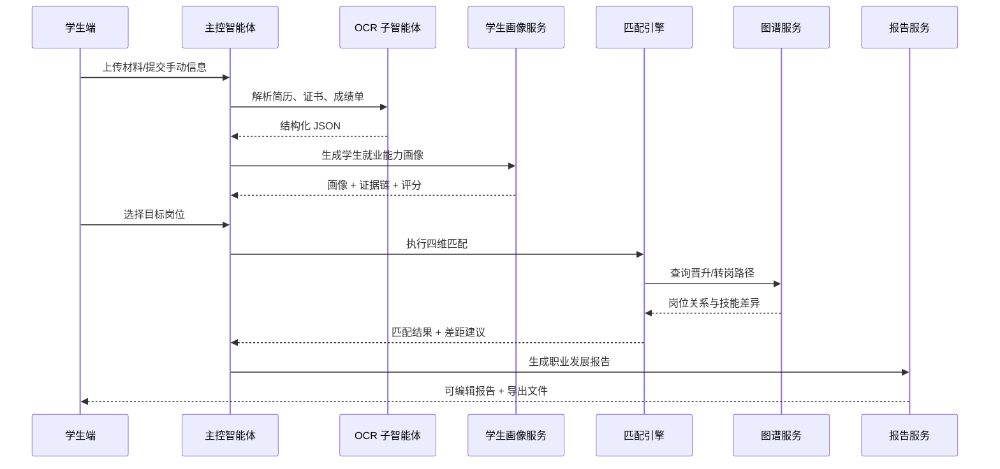

# 系统架构设计

## 1. 总体架构

CareerPilot 按“感知 - 认知 - 记忆 - 行动”分层设计，并以 OpenClaw 风格的主控智能体作为唯一业务入口。

### 模块分层

1. 用户交互层
   - 学生端 Web：材料上传、画像查看、匹配分析、路径规划、报告编辑导出。
   - 教师端工作台：查看学生画像/报告、点评与跟踪建议。
   - 管理后台：岗位数据管理、知识库管理、图谱管理、定时任务监控、系统配置。
2. 智能体调度层
   - 主控智能体 `MainControllerAgent`
   - 工具调用层 `ToolRegistry`
   - 子智能体群：`ResumeParsingAgent`、`JobProfileAgent`、`TrackingAgent`、`ReportGenerationAgent`
   - 状态管理：`WorkflowState` 持久化到 PostgreSQL
3. 感知层
   - `PaddleOCRProvider` 正式接口
   - `MockOCRProvider` 本地替代实现
   - 输出标准结构化 JSON
4. 认知与推理层
   - `ErnieLLMProvider` 正式接口
   - `MockLLMProvider` 本地替代实现
   - 岗位画像、学生画像、人岗匹配、职业路径、报告生成
5. 记忆与知识层
   - `RAGFlowProvider` 负责岗位知识、行业材料检索
   - `GraphProvider` 负责职位、技能、证书、路径图谱
6. 数据存储层
   - PostgreSQL：结构化业务数据
   - MinIO / Local Storage：文件与导出件
   - Neo4j / Mock Graph：职业图谱

## 2. 调用链

### 2.1 岗位知识构建链路

1. 管理端上传岗位 CSV
2. `JobImportService` 做字段标准化、技能抽取、公司归一化
3. `JobProfileAgent` 调用 LLM 生成岗位画像
4. `RAGKnowledgeService` 写入知识文档
5. `GraphSyncService` 写入 Job/Skill/Certificate/Capability 节点与边
6. 前端岗位探索页查询画像和图谱

### 2.2 学生画像生成链路

1. 学生上传简历/证书/成绩单或手动录入
2. `FileStorageService` 写入 MinIO / Local
3. `ResumeParsingAgent` 调用 OCR 解析文本与版面
4. `StudentProfileService` 融合 OCR 与手动输入
5. `MockLLMProvider / ErnieLLMProvider` 生成能力画像与评分依据
6. 画像结果存入 `student_profiles`、`student_profile_evidence`

### 2.3 人岗匹配与职业路径链路

1. 学生选择目标岗位
2. `MatchingService` 按四维模型逐项评分
3. `CareerPathService` 结合图谱查询主路径与备选路径
4. `ReportService` 汇总画像、匹配结果、行业趋势、行动计划
5. 导出 PDF / DOCX

### 2.4 闭环跟踪链路

1. 报告发布后创建 `growth_tasks`
2. `SchedulerService` 注册 cron 任务
3. 到期后生成提醒、资源推送、复盘记录
4. `FollowupService` 触发再评估

## 3. 时序

### 学生从上传到报告的时序

